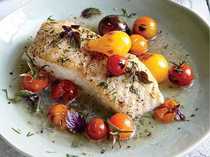

# Halibut with Charred Tomatoes and Dill

## Ingredients
* 4 (6-ounce) halibut fillets, skinned 
* 1/2 teaspoon salt, divided 
* 1/4 teaspoon freshly ground black pepper 
* 2 tablespoons butter 
* 1/2 cup dry white wine 
* 1 1/2 cups cherry, pear, or grape tomatoes 
* 1 teaspoon olive oil 
* 1 tablespoon chopped fresh dill 
* Oregano leaves (optional)

## Instructions
1. Heat a large skillet over medium-high heat. Sprinkle fish with 1/4 teaspoon salt and pepper. Add butter to pan; swirl until butter melts. Add fish; cook 1 minute. Add wine; cover, reduce heat to medium-low, and cook 7 minutes or until fish flakes easily when tested with a fork.

2. Heat a small skillet over high heat. Combine tomatoes and oil. Add to pan; cook 3 minutes or until lightly charred and beginning to soften.

3. Place 1 fillet in each of 4 shallow bowls; spoon cooking liquid evenly over fillets. Divide tomatoes among servings. Sprinkle with 1/4 teaspoon salt and dill. Garnish with oregano, if desired.

Source: Cooking Light, July 2014
