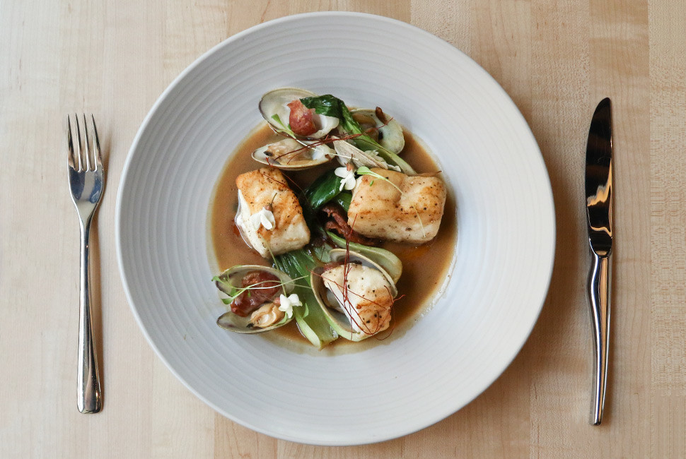

# Pan-seared Cod with Bok Choy and Soy Brown Butter

## Ingredients
* 4 cod portions (3 ounces each), from the thickest part of the fillet
* 1/8 cup Wondra flour
* 1 tablespoon canola oil
* 3 tablespoons whole butter, cold and diced
* 1 shallot, sliced
* 1 tablespoon garlic, minced
* 3 heads baby bok choy, halved and cleaned
* 1/8 cup soy sauce
* 1/2 cup water
* Salt and freshly ground pepper

## Instructions
_Makes 2 servings_

1. Preheat oven to 350°F. Heat a large sauté pan over medium heat, add the oil and swirl to evenly coat the bottom of the pan.
2. Season with salt and pepper and dust the fish with the flour. Once the pan is hot, gently place the fish in the hot pan.
3. Drop in the butter and swirl around the fish until brown. Flip over the fish once it is golden brown and cook for 1 to 2 minutes. Place the fish on a baking pan and place in the oven.
4. Once the fish is in the oven, add the shallots, garlic, and bok choy to the pan of brown butter. Stir the ingredients until they “get to know each other”. Deglaze with the soy sauce and the water. Cover the pan and cook until the fish is done - about 2 minutes. Taste the broth and adjust seasoning if needed.
