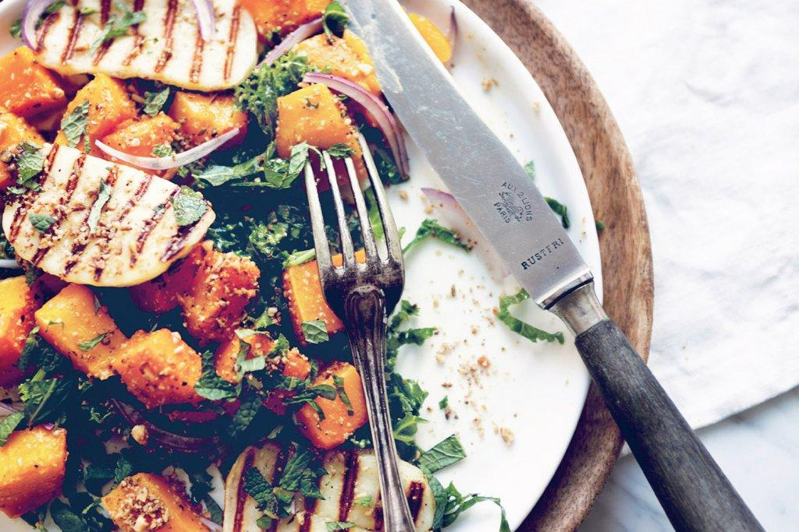

# Roasted Butternut Squash with Grilled Halloumi and Dukkah on Massaged Kale

## Ingredients
* 1 large butternut squash (about 3 pounds)
* 2 garlic cloves
* Knob of butter, melted
* 1 small bunch of kale
* Olive oil
* Freshly squeezed juice of 1/2 lemon
* 1 brick halloumi cheese
* Handful of fresh mint leaves, roughly chopped
* 1/2 red onion
* Dukkah

## Directions
1. Preheat the oven to 400&deg;F

2. Cut the butternut squash in half, remove the skin, scoop out the seeds, and chop the flesh into cubes. Mince the garlic. In a baking dish, toss the squash and garlic with the melted butter and sprinkle with salt and pepper. Roast for 25 to 35 minutes, until tender.

3. While the squash is roasting, prepare the kale: Remove and discard the ribs. Roll the leaves into a cigar shape and slice into ribbons. You should have 5 to 6 cups. Put the kale in a large bowl, drizzle with olive oil, add the lemon juice, and season with salt. Using your hands, massage the kale for 2 minutes until the leaves are dark green and tender.

4. Cut the halloumi into thin slices. Heat a grill pan or skillet over high heat. Add the halloumi slices and cook until grill marks appear (or until golden on the bottom if using a skillet.) Flip the slices over and repeat on the other side.

5. To assemble, put a portion of the massaked kale onto each plate. Top with cubes of roasted butternut squash and slices of grilled halloumi. Garnish each plate with the chopped mint, red onion slices, a generous dusting of dukkah, and a drizzle of olive oil. Season to taste with salt if desired.
