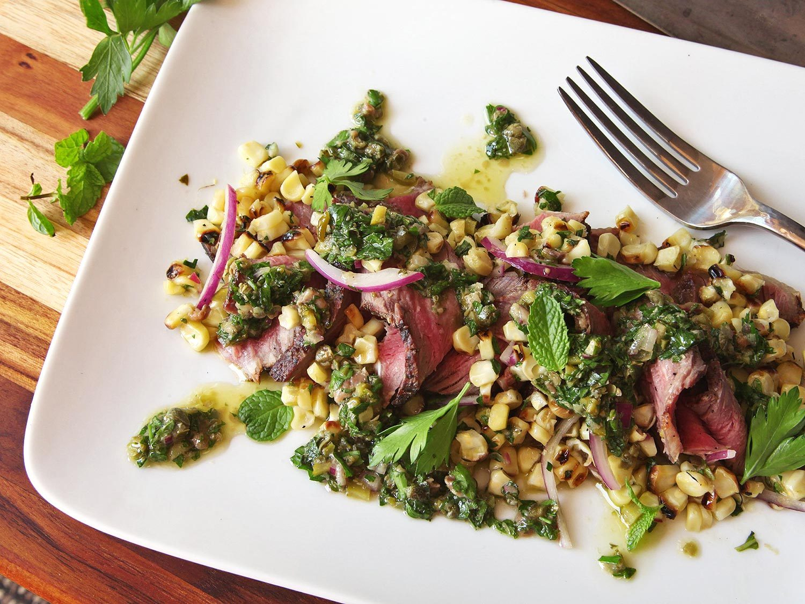

# Steak and Corn Salad with Salsa Verde 

## Ingredients
*For the Salsa Serde:*
* 2 tablespoons capers, drained and finely minced
* 8 cornichons, finely minced
* 2 medium cloves garlic, minced
* 1 cup fresh parsley leaves, minced, plus more for garnish
* 1/2 cup fresh mint leaves, minced, plus more for garnish
* 6 anchovy fillets, minced
* 1 small shallot, minced (about 2 tablespoons)
* 2 teaspoons Dijon mustard
* 2 tablespoons sherry vinegar
* 1/2 cup extra-virgin olive oil
* Kosher salt and freshly ground black pepper

*For the Salad*
* 2 ears corn, in the husk
* 3/4 pound leftover grilled or pan-seared steak, chilled and thinly sliced
* 1 red onion, thinly sliced

## Instructions

1. *For the Salsa Verde:* Combine capers, cornichons, garlic, parsley, mint, anchovies, shallot, mustard, and sherry vinegar in a large bowl. Whisking constantly, drizzle in extra-virgin olive oil. Season to taste with salt and pepper and set aside.

2. *For the Salad:* Shuck and grill corn over a hot grill or under the broiler, turning frequently, until tender and charred in spots, about 8 minutes total. Alternatively, place corn on a microwave-safe plate and microwave until steamed and tender, about 7 minutes. Allow to rest until cool enough to handle, then cut off kernels. Discard cobs.

3. Combine corn, steak, and red onion in a large bowl. Add 1/2 cup of the salsa verde and toss to combine. Season to taste with salt and pepper. Transfer to a serving platter and spoon additional salsa verde over. Garnish with parsley and mint leaves and serve immediately. Extra salsa verde can be stored in a sealed container in the refrigerator for up to 1 week.

Source: [Serious Eats](https://www.seriouseats.com/2015/09/spanish-salsa-verde-steak-salad-leftover.html)
